# wsl子系统安装
下载地址：https://ubuntu.com/desktop/wsl
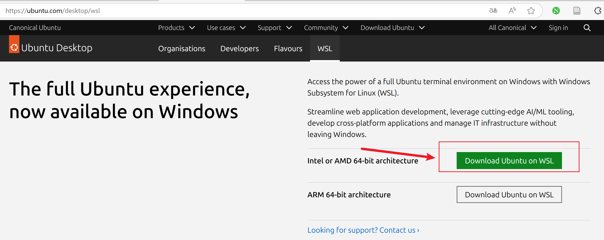
## 步骤1
启用 WSL 功能：
```powershell
wsl --install  # 自动安装 WSL（若未安装）
```
```powershell
设置为 WSL 2 模式（推荐）：
wsl --set-default-version 2
```
## 步骤 2：导入 WSL 发行版映像
### 1.打开 PowerShell（管理员权限）
右键开始菜单 → 选择 Windows Terminal (Admin) 或 PowerShell (Admin)。
### 2.导入 .wsl 文件
```powershell
wsl --import <自定义发行版名称> <安装路径> <映像文件路径>
```
```powershell
wsl --import Ubuntu-24.04 D:\dev_tools\Docker\Ubuntu-24.04 D:\dev_tools\Docker\ubuntu-24.04.2-wsl-amd64.wsl
```
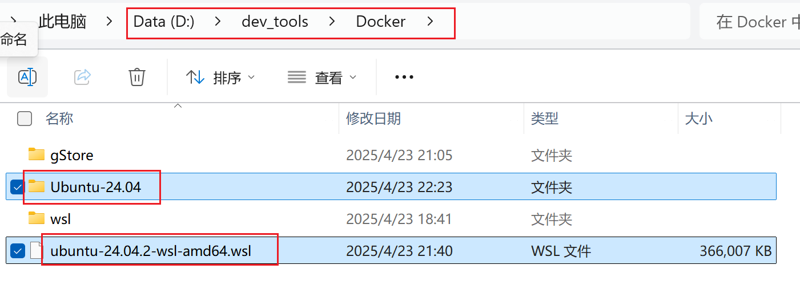
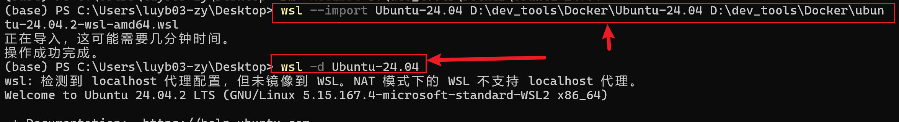
### 3.验证是否导入成功
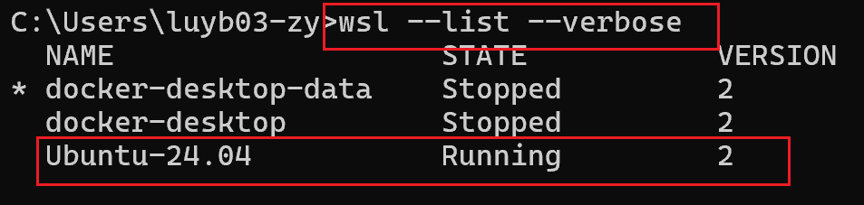
## 步骤 3：启动发行版
```powershell
wsl -d Ubuntu-24.04
```
#### 首次启动配置
首次进入会提示设置用户名和密码（如果是官方映像，可能需要手动创建用户）,但是我在实际操作中没有设置，直接用的root:
 在 WSL 终端中执行
```powershell
sudo adduser <用户名>
sudo usermod -aG sudo <用户名>
```
## 步骤 4：卸载发行版（不用时可以删除）
```powershell
wsl --unregister Ubuntu-24.04
rm -Recurse C:\WSL\Ubuntu-24.04  # 删除安装目录
```
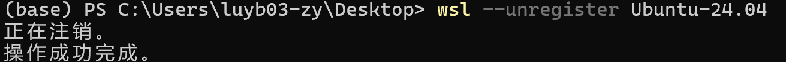
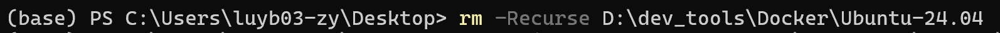
## 步骤5：网络配置
### 让 WSL 访问外部网络（联网、apt、curl）
1. 修改 DNS 配置（最常见）
```powershell
sudo rm /etc/resolv.conf
sudo bash -c 'echo "nameserver 8.8.8.8" > /etc/resolv.conf'
sudo chattr +i /etc/resolv.conf  # 锁定该文件防止被重写
```
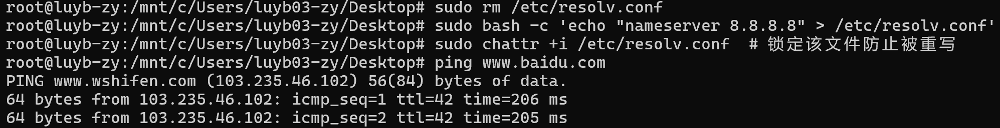
### 让 Windows 和 WSL 互相通信
#### Windows 访问 WSL 中的服务
默认自动转发，无需额外配置（WSL2 会自动映射到 Windows localhost）
比如你在 WSL 中启动了服务：
```base
python3 -m http.server 8000
```
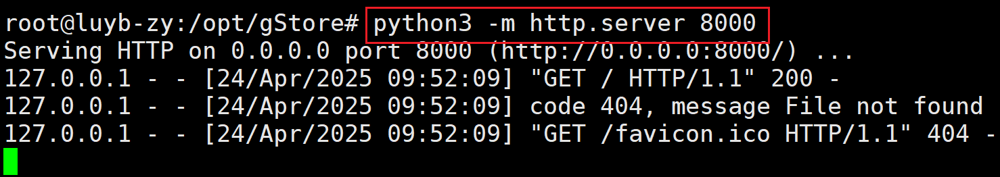
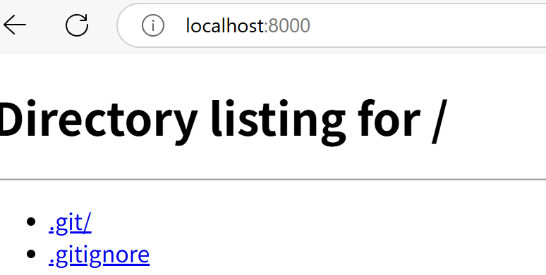

## 步骤6：修改root用户密码
```powershell
sudo passwd root
```
系统会提示你输入两次新密码：
```cpp
Enter new UNIX password:
Retype new UNIX password:
```
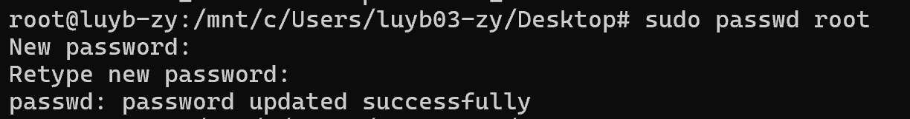
## 步骤7：如果想使用使用xshell连接（可选操作）
### 安装SSH
```powershell
sudo apt update
sudo apt install -y openssh-server
```
### 启动 SSH 服务：
```powershell
sudo service ssh start
```
### 配置 SSH（只做一次）：
```powershell
sudo nano /etc/ssh/sshd_config
```
### 保存并退出 nano 的快捷键操作：
#### 在你编辑完后，依次按以下键：
##### 1.按下 Ctrl + O （写出 Write Out = 保存）
它会提示你：File Name to Write: /etc/ssh/sshd_config
##### 2.直接按回车 Enter 确认文件名保存
##### 然后按 Ctrl + X（退出）
### 修改并确保
```powershell
PasswordAuthentication yes
PermitRootLogin yes
```
### 保存完建议执行以下命令重启 ssh：
```powershell
sudo service ssh restart 
```
# gStroe安装
## 步骤1：确保安装 5.0 以上版本的 gcc 和 g++ 
```powershell
sudo apt update
sudo apt install -y gcc g++
```
## 步骤2：clone方式下载gStroe
```bash
git clone https://github.com/pkumod/gStore.git
```
这里我放到了/opt/gStroe
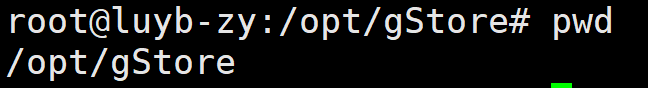
## 步骤3：使用官方推荐的办法自动配置环境问题
以下两步自动化的操作都应该/opt/gStroe下
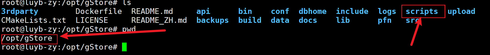
```bash
$ . scripts/setup/setup_ubuntu.sh
```
## 步骤4：使用官方推荐脚本编译（推荐）
```bash
$ bash scripts/build.sh
#若编译顺利完成，最后会出现 Compilation ends successfully! 结果
```
## 步骤5：初始化数据库
```bash
bin/ginit
```
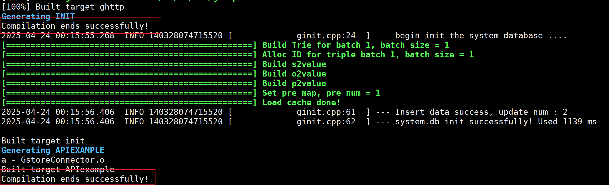
创建一个数据库
```bash
bin/gbuild -db lubm -f data/lubm/lubm.nt
```
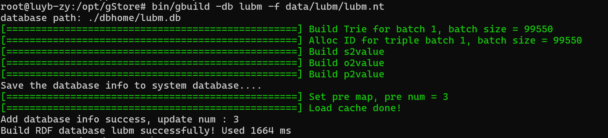
查看数据库
```bash
bin/gshow
```
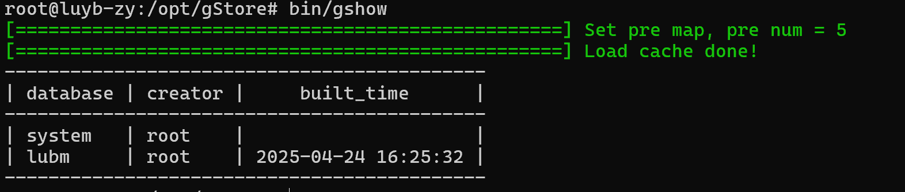
## 步骤6：配置tomcat8，为部署安装可视化gWorkbench做准备
### 1. 安装 Java，安装 OpenJDK
```powershell
sudo apt install openjdk-8-jdk
```
验证安装：
```powershell
java -version
```
### 2. 下载并解压 Tomcat
下载 Tomcat：
这是一个镜像网址：https://ftp.unicamp.br/pub/apache/tomcat/tomcat-8/v8.5.73/bin/
直接在网站里下载，然后上传到opt目录下
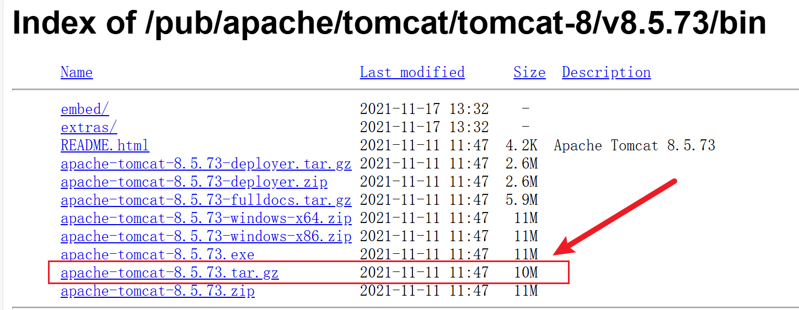

创建目录并解压：
```powershell
sudo mkdir /opt/tomcat
sudo tar -zxvf apache-tomcat-8.5.73.tar.gz -C /opt/tomcat
```
### 3. 启动 Tomcat
```powershell
# 这个目录不是固定的，只要到解压后的tomcat里找到bin目录即可
/opt/tomcat/apache-tomcat-8.5.73/bin/startup.sh
```
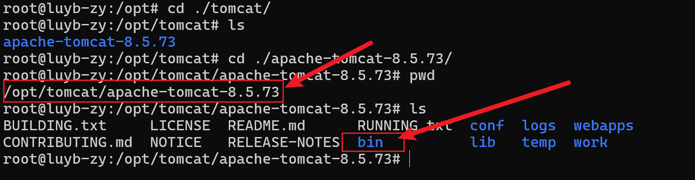
## 步骤7：gWorkbench安装
只需要把解压后的文件放到tomcat的webapps下面
```powershell
unzip gworkbench.zip
```
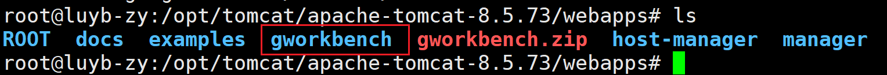
启动tomcat，就启动项目了
访问地址：http://localhost:8080/gworkbench/views/user/login.html
## 步骤8：运行gStore数据库
进入解压的gStore目录下：
开启gServer服务
```powershell
./bin/gserver --start
```
关闭gServer服务
```powershell
bin/gserver -t
```
启动http api服务（黑窗口不能关）
```powershell
./bin/ghttp
```
后台启动http服务 默认端口号9000
```powershell
nohup ./bin/ghttp & 
```
关闭http api服务
```powershell
bin/shutdown
```